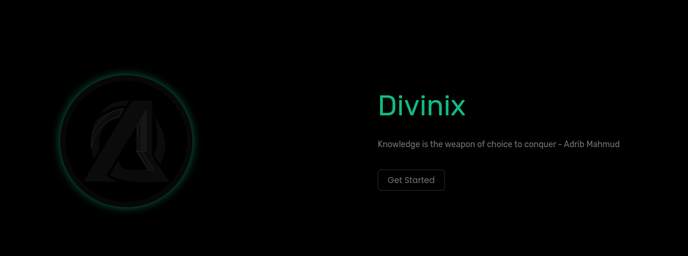

Divinix - Seamless Educational Integration for Digital Learners

🛠️ Customization at Your Fingertips: Tailor EduInteract to your specific needs. Fine-tune themes, layouts, and settings to match your educational style and preferences.

Whether you're creating a digital textbook, an interactive study guide, or a multimedia-rich course, EduInteract revolutionizes the way educational content is presented and consumed. Elevate your teaching and learning experience by bringing your educational concepts to life in the digital realm. Let the journey of knowledge-sharing begin!

🎓 Efficiency Amplified: Boost productivity with EduInteract's intuitive interface and efficient content organization. Seamlessly arrange chapters, embed multimedia, and structure your educational concepts for an optimal learning journey.

